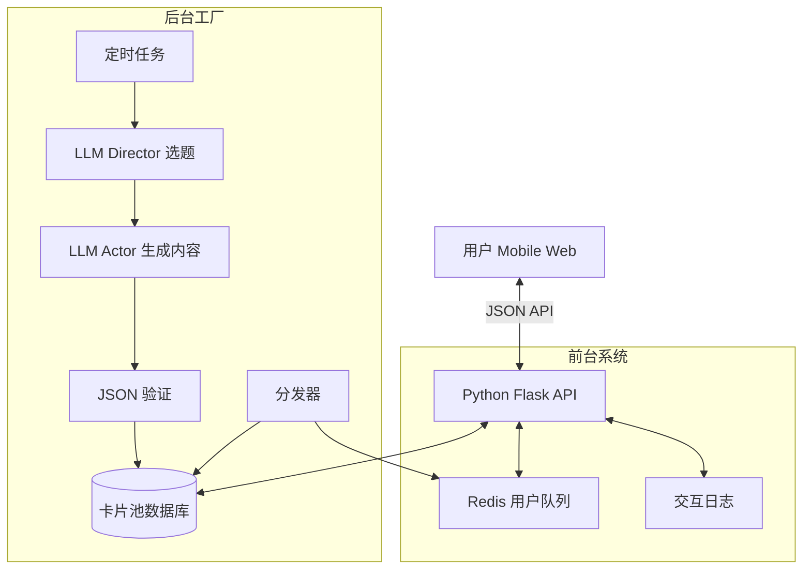

# MindSlot - 脑力老虎机

一个基于 LLM 生成、异步预加载、高信噪比的沉浸式信息流应用。

## 项目简介

MindSlot 是一个创新的知识消费平台，采用"前店后厂"架构，将耗时的 LLM 内容生成与实时的用户交互完全解耦。用户可以像刷 TikTok 一样刷知识卡片，每张卡片都是精心设计的、包含图表和代码的结构化内容。

### 核心特性

- 🎰 **异步预生产**：后台 LLM 工厂持续生成内容，前台即刻消费
- 🎨 **结构化渲染**：支持 Mermaid 图表、代码高亮、多种样式主题
- 🧠 **高信噪比**：每张卡片都经过精心设计，杜绝废话
- 📱 **沉浸式体验**：全屏卡片式交互，专注当下
- 🔄 **智能推荐**：基于用户行为的内容分发（MVP 阶段为随机+去重）

## 技术栈

### 后端
- **Python 3.10+** 
- **Flask** - Web 框架
- **SQLAlchemy** - ORM
- **Redis** - 用户队列缓存
- **APScheduler** - 定时任务
- **OpenAI SDK / DeepSeek SDK** - LLM 调用

### 前端
- **React 18** + **Vite**
- **TailwindCSS** - 样式
- **Framer Motion** - 动画
- **Mermaid.js** - 图表渲染
- **React-Markdown** - Markdown 渲染
- **Prism.js** - 代码高亮

### 数据库
- **SQLite** (开发) / **PostgreSQL** (生产)
- **Redis** (用户队列 + Session)

## 系统架构



## 快速开始

### 环境准备

```bash
# 克隆项目
git clone https://github.com/yourusername/mindslot.git
cd mindslot

# 后端环境
cd backend
python -m venv venv
source venv/bin/activate  # Windows: venv\Scripts\activate
pip install -r requirements.txt

# 前端环境
cd ../frontend
npm install
```

### 配置

创建 `backend/.env` 文件：

```bash
# LLM API 配置
OPENAI_API_KEY=your_api_key_here
# 或使用 DeepSeek
DEEPSEEK_API_KEY=your_deepseek_api_key
DEEPSEEK_BASE_URL=https://api.deepseek.com

# Redis 配置
REDIS_HOST=localhost
REDIS_PORT=6379
REDIS_PASSWORD=

# 数据库配置
DATABASE_URL=sqlite:///mindslot.db

# 后台工厂配置
FACTORY_INTERVAL=3600  # 每小时生成一批内容
BATCH_SIZE=20  # 每批生成 20 张卡片
```

### 启动服务

```bash
# 1. 启动 Redis
redis-server

# 2. 初始化数据库并生成初始内容
cd backend
python scripts/init_db.py
python scripts/factory.py --generate 20

# 3. 启动后端服务
python app.py

# 4. 启动前端开发服务器（新终端）
cd frontend
npm run dev
```

访问 http://localhost:5173 开始体验！

## 项目结构

```
mindslot/
├── backend/
│   ├── app.py                    # Flask 应用入口
│   ├── config.py                 # 配置管理
│   ├── models/
│   │   ├── card.py              # Card 数据模型
│   │   ├── interaction.py       # Interaction 数据模型
│   │   └── user.py              # User 数据模型
│   ├── services/
│   │   ├── llm_service.py       # LLM 调用封装
│   │   ├── card_service.py      # 卡片业务逻辑
│   │   └── queue_service.py     # Redis 队列管理
│   ├── agents/
│   │   ├── director.py          # Director Agent 选题
│   │   ├── actor.py             # Actor Agent 生成内容
│   │   └── validator.py         # 内容验证
│   ├── routes/
│   │   ├── feed.py              # 信息流 API
│   │   └── interaction.py       # 交互 API
│   ├── scripts/
│   │   ├── init_db.py           # 数据库初始化
│   │   └── factory.py           # 内容生成工厂
│   └── requirements.txt
├── frontend/
│   ├── src/
│   │   ├── App.tsx
│   │   ├── components/
│   │   │   ├── Card/
│   │   │   │   ├── CardRenderer.tsx   # 卡片渲染器
│   │   │   │   ├── BlockRenderer.tsx  # Block 渲染器
│   │   │   │   └── StylePresets.ts    # 样式主题
│   │   │   ├── Feed/
│   │   │   │   └── FeedContainer.tsx  # 信息流容器
│   │   │   └── UI/
│   │   │       └── GestureHandler.tsx # 手势处理
│   │   ├── services/
│   │   │   └── api.ts           # API 调用封装
│   │   └── types/
│   │       └── card.ts          # TypeScript 类型定义
│   ├── package.json
│   └── vite.config.ts
├── prompts.md                    # LLM Prompts 提示词库
├── design.md                     # 设计文档
└── README.md                     # 本文件
```

## 核心代码实现

### 1. 后端核心代码

#### `backend/app.py` - Flask 应用主入口

```python
from flask import Flask, jsonify, request
from flask_cors import CORS
from config import Config
from models import db
from routes.feed import feed_bp
from routes.interaction import interaction_bp
from services.queue_service import QueueService
from apscheduler.schedulers.background import BackgroundScheduler
from scripts.factory import run_factory

app = Flask(__name__)
app.config.from_object(Config)
CORS(app)

# 初始化数据库
db.init_app(app)

# 注册路由
app.register_blueprint(feed_bp, url_prefix='/api/feed')
app.register_blueprint(interaction_bp, url_prefix='/api/interaction')

# 初始化调度器
scheduler = BackgroundScheduler()
scheduler.add_job(
    func=run_factory,
    trigger="interval",
    seconds=Config.FACTORY_INTERVAL,
    args=[Config.BATCH_SIZE]
)
scheduler.start()

@app.route('/health')
def health():
    return jsonify({"status": "ok"})

if __name__ == '__main__':
    with app.app_context():
        db.create_all()
    app.run(host='0.0.0.0', port=5000, debug=True)
```

#### `backend/models/card.py` - Card 数据模型

```python
from models import db
from sqlalchemy.dialects.postgresql import UUID, JSON
import uuid
from datetime import datetime

class Card(db.Model):
    __tablename__ = 'cards'
    
    id = db.Column(UUID(as_uuid=True), primary_key=True, default=uuid.uuid4)
    topic = db.Column(db.String(255), nullable=False, index=True)
    tags = db.Column(JSON, nullable=False)  # ["Java", "JVM"]
    complexity = db.Column(db.Integer, nullable=False)  # 1-5
    payload = db.Column(JSON, nullable=False)  # 完整的卡片内容
    created_at = db.Column(db.DateTime, default=datetime.utcnow)
    
    def to_dict(self):
        return {
            'id': str(self.id),
            'topic': self.topic,
            'tags': self.tags,
            'complexity': self.complexity,
            'payload': self.payload,
            'created_at': self.created_at.isoformat()
        }
```

#### `backend/models/interaction.py` - Interaction 数据模型

```python
from models import db
from sqlalchemy.dialects.postgresql import UUID
import uuid
from datetime import datetime

class Interaction(db.Model):
    __tablename__ = 'interactions'
    
    id = db.Column(UUID(as_uuid=True), primary_key=True, default=uuid.uuid4)
    user_id = db.Column(UUID(as_uuid=True), nullable=False, index=True)
    card_id = db.Column(UUID(as_uuid=True), db.ForeignKey('cards.id'), nullable=False)
    action = db.Column(db.Enum('LIKE', 'SKIP', 'FINISH_READ', 'EXPAND', name='interaction_action'))
    duration = db.Column(db.Integer)  # 停留毫秒数
    created_at = db.Column(db.DateTime, default=datetime.utcnow, index=True)
    
    card = db.relationship('Card', backref='interactions')
```

#### `backend/services/llm_service.py` - LLM 调用服务

```python
import os
from openai import OpenAI

class LLMService:
    def __init__(self):
        # 支持 OpenAI 或 DeepSeek
        if os.getenv('DEEPSEEK_API_KEY'):
            self.client = OpenAI(
                api_key=os.getenv('DEEPSEEK_API_KEY'),
                base_url=os.getenv('DEEPSEEK_BASE_URL', 'https://api.deepseek.com')
            )
            self.model = 'deepseek-chat'
        else:
            self.client = OpenAI(api_key=os.getenv('OPENAI_API_KEY'))
            self.model = 'gpt-4o'
    
    def call(self, system_prompt, user_prompt, temperature=0.8, response_format=None):
        messages = [
            {"role": "system", "content": system_prompt},
            {"role": "user", "content": user_prompt}
        ]
        
        kwargs = {
            "model": self.model,
            "messages": messages,
            "temperature": temperature
        }
        
        if response_format:
            kwargs["response_format"] = response_format
        
        response = self.client.chat.completions.create(**kwargs)
        return response.choices[0].message.content
```

#### `backend/agents/director.py` - Director Agent

```python
import json
from services.llm_service import LLMService

DIRECTOR_SYSTEM_PROMPT = """你是 MindSlot 的内容总监 (Content Director)。你的任务是为一个沉浸式学习应用生成高质量的选题清单。

你的职责：
1. 生成多样化的话题，涵盖技术、历史、科学、文化等领域
2. 为每个话题指定合适的语气 (tone) 和呈现格式 (format)
3. 确保内容既有深度又有趣味性，避免枯燥的说教

输出格式：严格的 JSON 数组，每个对象必须包含以下字段：
- topic: 话题标题 (字符串)
- tone: 语气风格 (可选值: "Excited", "Sarcastic", "Philosophical", "Playful", "Dark_Humor")
- format: 呈现格式 (可选值: "code_comparison", "rant", "story", "debate", "meme_analysis")
- complexity: 复杂度 1-5 (1=通识, 5=硬核)
- tags: 标签数组 (例如: ["Java", "Performance", "JVM"])"""

DIRECTOR_USER_PROMPT = """请生成 {count} 个卡片选题，领域包括：{domains}

要求：
1. 话题必须具体且有争议性或反常识性
2. 60% 技术话题，30% 通识话题，10% 整活/梗文化
3. 语气要多样化，避免千篇一律
4. 每个话题必须能在 2-3 分钟内消费完

直接返回 JSON 数组，不要任何额外解释。"""

class DirectorAgent:
    def __init__(self):
        self.llm = LLMService()
    
    def generate_topics(self, count=20, domains="Java, Python, AI, History, Science"):
        user_prompt = DIRECTOR_USER_PROMPT.format(count=count, domains=domains)
        
        response = self.llm.call(
            system_prompt=DIRECTOR_SYSTEM_PROMPT,
            user_prompt=user_prompt,
            temperature=0.9
        )
        
        try:
            topics = json.loads(response)
            return topics
        except json.JSONDecodeError as e:
            print(f"Failed to parse Director response: {e}")
            print(f"Raw response: {response}")
            return []
```

#### `backend/agents/actor.py` - Actor Agent

```python
import json
from services.llm_service import LLMService

ACTOR_SYSTEM_PROMPT = """你是 MindSlot 的内容创作者 (Content Actor)。你的任务是根据给定的选题，生成符合 Card Protocol 的结构化 JSON 内容。

你的人设：
- 你不是一个"有用的 AI 助手"，你是一个充满个性的资深工程师/知识博主
- 你可以吐槽、调侃、使用暗黑幽默，但不能低俗
- 你的目标是用最短的篇幅击穿一个知识点的本质

核心原则：
1. 信噪比至上：每个 block 必须承载有效信息，禁止废话和客套
2. 视觉优先：优先使用 Mermaid 图表、代码示例，而非长文本
3. 文本限制：单个 text block 不超过 50 字
4. 钩子设计：hook_text 必须制造悬念或颠覆常识

输出格式：严格遵循以下 JSON Schema

{
  "card_id": "c-{unique_id}",
  "style_preset": "{样式主题}",
  "title": "{标题}",
  "hook_text": "{开场钩子，20-30字}",
  "blocks": [
    {
      "type": "chat_bubble | mermaid | markdown | code_snippet | quote",
      "role": "roast_master | wise_sage | chaos_agent",
      "lang": "python | java | bash",
      "content": "{内容}"
    }
  ]
}"""

ACTOR_USER_PROMPT = """请根据以下选题生成一张卡片：

话题 (Topic): {topic}
语气 (Tone): {tone}
格式偏好 (Format): {format}
复杂度 (Complexity): {complexity}
标签 (Tags): {tags}

内容要求：
1. 必须包含至少 1 个 Mermaid 图表
2. 如果是技术话题，必须包含 1-2 个代码示例
3. 使用 {tone} 的语气风格贯穿全文
4. blocks 数量控制在 4-7 个之间
5. title 必须具有吸引力

style_preset 可选值：cyberpunk_terminal, paper_notes, comic_strip, zen_minimalist
role 可选值：roast_master, wise_sage, chaos_agent

现在开始生成，直接返回 JSON，不要任何额外解释。"""

class ActorAgent:
    def __init__(self):
        self.llm = LLMService()
    
    def generate_card(self, topic_data):
        user_prompt = ACTOR_USER_PROMPT.format(
            topic=topic_data['topic'],
            tone=topic_data['tone'],
            format=topic_data['format'],
            complexity=topic_data['complexity'],
            tags=', '.join(topic_data['tags'])
        )
        
        response = self.llm.call(
            system_prompt=ACTOR_SYSTEM_PROMPT,
            user_prompt=user_prompt,
            temperature=0.8
        )
        
        try:
            card_payload = json.loads(response)
            return card_payload
        except json.JSONDecodeError as e:
            print(f"Failed to parse Actor response: {e}")
            return None
```

#### `backend/services/queue_service.py` - Redis 队列服务

```python
import redis
import os
from typing import List

class QueueService:
    def __init__(self):
        self.redis_client = redis.Redis(
            host=os.getenv('REDIS_HOST', 'localhost'),
            port=int(os.getenv('REDIS_PORT', 6379)),
            password=os.getenv('REDIS_PASSWORD', None),
            decode_responses=True
        )
    
    def get_queue_key(self, user_id: str) -> str:
        return f"queue:user:{user_id}"
    
    def get_queue_length(self, user_id: str) -> int:
        key = self.get_queue_key(user_id)
        return self.redis_client.llen(key)
    
    def push_cards(self, user_id: str, card_ids: List[str]):
        """批量推送卡片 ID 到用户队列"""
        key = self.get_queue_key(user_id)
        if card_ids:
            self.redis_client.rpush(key, *card_ids)
    
    def pop_card(self, user_id: str) -> str:
        """从队列头部取出一张卡片"""
        key = self.get_queue_key(user_id)
        return self.redis_client.lpop(key)
    
    def peek_queue(self, user_id: str, count: int = 10) -> List[str]:
        """查看队列前 N 张卡片（不移除）"""
        key = self.get_queue_key(user_id)
        return self.redis_client.lrange(key, 0, count - 1)
```

#### `backend/routes/feed.py` - Feed API 路由

```python
from flask import Blueprint, jsonify, request
from models import db
from models.card import Card
from models.interaction import Interaction
from services.queue_service import QueueService
import uuid

feed_bp = Blueprint('feed', __name__)
queue_service = QueueService()

@feed_bp.route('/next', methods=['GET'])
def get_next_card():
    """获取下一张卡片"""
    user_id = request.args.get('user_id', str(uuid.uuid4()))  # MVP: 自动生成匿名用户
    
    # 1. 从 Redis 队列获取
    card_id = queue_service.pop_card(user_id)
    
    # 2. 如果队列为空，触发补货
    if not card_id:
        replenish_queue(user_id)
        card_id = queue_service.pop_card(user_id)
    
    # 3. 如果还是没有，返回错误
    if not card_id:
        return jsonify({"error": "No cards available"}), 404
    
    # 4. 从数据库获取卡片内容
    card = Card.query.get(uuid.UUID(card_id))
    if not card:
        return jsonify({"error": "Card not found"}), 404
    
    # 5. 检查队列长度，如果低于阈值，异步补货
    queue_length = queue_service.get_queue_length(user_id)
    if queue_length < 5:
        # TODO: 异步触发补货任务
        pass
    
    return jsonify(card.to_dict())

def replenish_queue(user_id: str, count: int = 10):
    """补货逻辑：从卡片池随机获取未看过的卡片"""
    # 1. 获取用户已看过的卡片
    viewed_card_ids = db.session.query(Interaction.card_id).filter(
        Interaction.user_id == uuid.UUID(user_id)
    ).all()
    viewed_ids = [str(cid[0]) for cid in viewed_card_ids]
    
    # 2. 随机获取未看过的卡片
    query = Card.query
    if viewed_ids:
        query = query.filter(Card.id.notin_([uuid.UUID(cid) for cid in viewed_ids]))
    
    cards = query.order_by(db.func.random()).limit(count).all()
    
    # 3. 推送到 Redis 队列
    card_ids = [str(card.id) for card in cards]
    queue_service.push_cards(user_id, card_ids)
    
    return len(card_ids)

@feed_bp.route('/queue/status', methods=['GET'])
def queue_status():
    """查看队列状态"""
    user_id = request.args.get('user_id')
    if not user_id:
        return jsonify({"error": "user_id required"}), 400
    
    length = queue_service.get_queue_length(user_id)
    return jsonify({"queue_length": length})
```

#### `backend/routes/interaction.py` - Interaction API 路由

```python
from flask import Blueprint, jsonify, request
from models import db
from models.interaction import Interaction
import uuid

interaction_bp = Blueprint('interaction', __name__)

@interaction_bp.route('/record', methods=['POST'])
def record_interaction():
    """记录用户交互行为"""
    data = request.get_json()
    
    required_fields = ['user_id', 'card_id', 'action']
    if not all(field in data for field in required_fields):
        return jsonify({"error": "Missing required fields"}), 400
    
    interaction = Interaction(
        user_id=uuid.UUID(data['user_id']),
        card_id=uuid.UUID(data['card_id']),
        action=data['action'],
        duration=data.get('duration')
    )
    
    db.session.add(interaction)
    db.session.commit()
    
    return jsonify({"status": "ok", "id": str(interaction.id)})

@interaction_bp.route('/stats', methods=['GET'])
def get_stats():
    """获取用户统计数据"""
    user_id = request.args.get('user_id')
    if not user_id:
        return jsonify({"error": "user_id required"}), 400
    
    total = Interaction.query.filter_by(user_id=uuid.UUID(user_id)).count()
    likes = Interaction.query.filter_by(
        user_id=uuid.UUID(user_id),
        action='LIKE'
    ).count()
    
    return jsonify({
        "total_interactions": total,
        "total_likes": likes
    })
```

#### `backend/scripts/factory.py` - 内容生成工厂

```python
from agents.director import DirectorAgent
from agents.actor import ActorAgent
from models import db
from models.card import Card
import sys

def run_factory(batch_size=20):
    """运行内容生成工厂"""
    print(f"Starting factory run: generating {batch_size} cards...")
    
    director = DirectorAgent()
    actor = ActorAgent()
    
    # 1. Director 生成选题
    topics = director.generate_topics(count=batch_size)
    print(f"Director generated {len(topics)} topics")
    
    # 2. Actor 逐个生成内容
    created_count = 0
    for topic_data in topics:
        try:
            print(f"Generating card for topic: {topic_data['topic']}")
            payload = actor.generate_card(topic_data)
            
            if payload:
                # 3. 存入数据库
                card = Card(
                    topic=topic_data['topic'],
                    tags=topic_data['tags'],
                    complexity=topic_data['complexity'],
                    payload=payload
                )
                db.session.add(card)
                db.session.commit()
                created_count += 1
                print(f"✓ Card created: {card.id}")
        except Exception as e:
            print(f"✗ Failed to generate card: {e}")
            db.session.rollback()
    
    print(f"Factory run completed: {created_count}/{batch_size} cards created")
    return created_count

if __name__ == '__main__':
    from app import app
    with app.app_context():
        batch_size = int(sys.argv[1]) if len(sys.argv) > 1 else 20
        run_factory(batch_size)
```

#### `backend/requirements.txt`

```
Flask==3.0.0
Flask-CORS==4.0.0
Flask-SQLAlchemy==3.1.1
python-dotenv==1.0.0
redis==5.0.1
openai==1.3.0
APScheduler==3.10.4
psycopg2-binary==2.9.9
```

---

### 2. 前端核心代码

#### `frontend/src/types/card.ts` - 类型定义

```typescript
export interface CardPayload {
  card_id: string;
  style_preset: 'cyberpunk_terminal' | 'paper_notes' | 'comic_strip' | 'zen_minimalist';
  title: string;
  hook_text: string;
  blocks: Block[];
}

export type BlockType = 'chat_bubble' | 'mermaid' | 'markdown' | 'code_snippet' | 'quote';
export type Role = 'roast_master' | 'wise_sage' | 'chaos_agent';

export interface Block {
  type: BlockType;
  role?: Role;
  lang?: string;
  content: string;
}

export interface Card {
  id: string;
  topic: string;
  tags: string[];
  complexity: number;
  payload: CardPayload;
  created_at: string;
}
```

#### `frontend/src/services/api.ts` - API 封装

```typescript
const API_BASE = import.meta.env.VITE_API_BASE || 'http://localhost:5000/api';

export class APIService {
  private userId: string;

  constructor() {
    // MVP: 使用 localStorage 存储用户 ID
    this.userId = localStorage.getItem('mindslot_user_id') || this.generateUserId();
  }

  private generateUserId(): string {
    const id = crypto.randomUUID();
    localStorage.setItem('mindslot_user_id', id);
    return id;
  }

  async getNextCard(): Promise<Card> {
    const response = await fetch(`${API_BASE}/feed/next?user_id=${this.userId}`);
    if (!response.ok) {
      throw new Error('Failed to fetch card');
    }
    return response.json();
  }

  async recordInteraction(cardId: string, action: string, duration?: number) {
    await fetch(`${API_BASE}/interaction/record`, {
      method: 'POST',
      headers: { 'Content-Type': 'application/json' },
      body: JSON.stringify({
        user_id: this.userId,
        card_id: cardId,
        action,
        duration
      })
    });
  }

  async getQueueStatus(): Promise<{ queue_length: number }> {
    const response = await fetch(`${API_BASE}/feed/queue/status?user_id=${this.userId}`);
    return response.json();
  }
}
```

#### `frontend/src/components/Card/BlockRenderer.tsx` - Block 渲染器

```tsx
import React from 'react';
import ReactMarkdown from 'react-markdown';
import mermaid from 'mermaid';
import { Prism as SyntaxHighlighter } from 'react-syntax-highlighter';
import { vscDarkPlus } from 'react-syntax-highlighter/dist/esm/styles/prism';
import { Block } from '../../types/card';

mermaid.initialize({ startOnLoad: true, theme: 'dark' });

interface BlockRendererProps {
  block: Block;
}

export const BlockRenderer: React.FC<BlockRendererProps> = ({ block }) => {
  const mermaidRef = React.useRef<HTMLDivElement>(null);

  React.useEffect(() => {
    if (block.type === 'mermaid' && mermaidRef.current) {
      mermaid.contentLoaded();
    }
  }, [block]);

  switch (block.type) {
    case 'chat_bubble':
      return (
        <div className={`chat-bubble role-${block.role} p-4 rounded-lg my-3`}>
          <div className="role-badge text-xs opacity-70 mb-1">
            {block.role?.replace('_', ' ').toUpperCase()}
          </div>
          <p className="text-base">{block.content}</p>
        </div>
      );

    case 'mermaid':
      return (
        <div ref={mermaidRef} className="mermaid-container my-4 p-4 bg-gray-900 rounded-lg overflow-x-auto">
          <div className="mermaid">
            {block.content}
          </div>
        </div>
      );

    case 'markdown':
      return (
        <div className="markdown-block my-3 prose prose-invert max-w-none">
          <ReactMarkdown>{block.content}</ReactMarkdown>
        </div>
      );

    case 'code_snippet':
      return (
        <div className="code-block my-3">
          <SyntaxHighlighter
            language={block.lang || 'javascript'}
            style={vscDarkPlus}
            customStyle={{ borderRadius: '0.5rem', padding: '1rem' }}
          >
            {block.content}
          </SyntaxHighlighter>
        </div>
      );

    case 'quote':
      return (
        <blockquote className="quote-block border-l-4 border-cyan-500 pl-4 italic my-3">
          {block.content}
        </blockquote>
      );

    default:
      return <div className="my-3">{block.content}</div>;
  }
};
```

#### `frontend/src/components/Card/CardRenderer.tsx` - 卡片渲染器

```tsx
import React from 'react';
import { motion } from 'framer-motion';
import { Card } from '../../types/card';
import { BlockRenderer } from './BlockRenderer';
import './CardStyles.css';

interface CardRendererProps {
  card: Card;
  onSwipeUp: () => void;
  onDoubleTap: () => void;
}

export const CardRenderer: React.FC<CardRendererProps> = ({ card, onSwipeUp, onDoubleTap }) => {
  const { payload } = card;

  return (
    <motion.div
      className={`card-container ${payload.style_preset} h-screen w-full overflow-y-auto snap-start`}
      initial={{ opacity: 0, y: 50 }}
      animate={{ opacity: 1, y: 0 }}
      exit={{ opacity: 0, y: -50 }}
      onDoubleClick={onDoubleTap}
    >
      <div className="card-content max-w-2xl mx-auto p-6">
        {/* Header */}
        <div className="card-header mb-6">
          <h1 className="text-3xl font-bold mb-2">{payload.title}</h1>
          <p className="hook-text text-lg opacity-80 italic">{payload.hook_text}</p>
          <div className="tags flex gap-2 mt-3">
            {card.tags.map((tag, idx) => (
              <span key={idx} className="tag px-2 py-1 bg-cyan-700 rounded text-xs">
                {tag}
              </span>
            ))}
          </div>
        </div>

        {/* Blocks */}
        <div className="card-blocks">
          {payload.blocks.map((block, idx) => (
            <BlockRenderer key={idx} block={block} />
          ))}
        </div>

        {/* Footer */}
        <div className="card-footer mt-8 text-center opacity-50 text-sm">
          <p>👆 双击收藏 · 👆 上滑下一张</p>
        </div>
      </div>
    </motion.div>
  );
};
```

#### `frontend/src/components/Feed/FeedContainer.tsx` - 信息流容器

```tsx
import React, { useState, useEffect } from 'react';
import { CardRenderer } from '../Card/CardRenderer';
import { APIService } from '../../services/api';
import { Card } from '../../types/card';

const api = new APIService();

export const FeedContainer: React.FC = () => {
  const [currentCard, setCurrentCard] = useState<Card | null>(null);
  const [loading, setLoading] = useState(true);
  const [startTime, setStartTime] = useState(Date.now());

  const loadNextCard = async () => {
    setLoading(true);
    try {
      const card = await api.getNextCard();
      setCurrentCard(card);
      setStartTime(Date.now());
    } catch (error) {
      console.error('Failed to load card:', error);
    } finally {
      setLoading(false);
    }
  };

  const handleSwipeUp = async () => {
    if (!currentCard) return;
    
    const duration = Date.now() - startTime;
    await api.recordInteraction(currentCard.id, 'SKIP', duration);
    loadNextCard();
  };

  const handleDoubleTap = async () => {
    if (!currentCard) return;
    
    await api.recordInteraction(currentCard.id, 'LIKE');
    // 可以添加视觉反馈
    console.log('Card liked!');
  };

  useEffect(() => {
    loadNextCard();
  }, []);

  if (loading || !currentCard) {
    return (
      <div className="flex items-center justify-center h-screen bg-gray-900 text-white">
        <div className="text-xl">Loading...</div>
      </div>
    );
  }

  return (
    <div className="feed-container">
      <CardRenderer
        card={currentCard}
        onSwipeUp={handleSwipeUp}
        onDoubleTap={handleDoubleTap}
      />
    </div>
  );
};
```

#### `frontend/src/App.tsx` - 应用入口

```tsx
import React from 'react';
import { FeedContainer } from './components/Feed/FeedContainer';
import './App.css';

function App() {
  return (
    <div className="App">
      <FeedContainer />
    </div>
  );
}

export default App;
```

#### `frontend/package.json`

```json
{
  "name": "mindslot-frontend",
  "version": "0.1.0",
  "type": "module",
  "scripts": {
    "dev": "vite",
    "build": "tsc && vite build",
    "preview": "vite preview"
  },
  "dependencies": {
    "react": "^18.2.0",
    "react-dom": "^18.2.0",
    "react-markdown": "^9.0.0",
    "framer-motion": "^10.16.0",
    "mermaid": "^10.6.0",
    "react-syntax-highlighter": "^15.5.0"
  },
  "devDependencies": {
    "@types/react": "^18.2.0",
    "@types/react-dom": "^18.2.0",
    "@vitejs/plugin-react": "^4.2.0",
    "autoprefixer": "^10.4.16",
    "postcss": "^8.4.32",
    "tailwindcss": "^3.3.6",
    "typescript": "^5.3.0",
    "vite": "^5.0.0"
  }
}
```

---

## API 文档

### Feed API

#### GET /api/feed/next
获取下一张卡片

**Query Parameters:**
- `user_id` (optional): 用户 ID，如果不提供会自动生成

**Response:**
```json
{
  "id": "uuid",
  "topic": "Java Virtual Threads",
  "tags": ["Java", "Concurrency"],
  "complexity": 4,
  "payload": { ... },
  "created_at": "2025-01-01T00:00:00"
}
```

#### GET /api/feed/queue/status
查看队列状态

**Query Parameters:**
- `user_id` (required): 用户 ID

**Response:**
```json
{
  "queue_length": 8
}
```

### Interaction API

#### POST /api/interaction/record
记录用户交互

**Body:**
```json
{
  "user_id": "uuid",
  "card_id": "uuid",
  "action": "LIKE | SKIP | FINISH_READ | EXPAND",
  "duration": 15000
}
```

#### GET /api/interaction/stats
获取用户统计

**Query Parameters:**
- `user_id` (required): 用户 ID

**Response:**
```json
{
  "total_interactions": 150,
  "total_likes": 42
}
```

---

## 开发指南

### 添加新的 Block 类型

1. 在 `types/card.ts` 中添加新类型
2. 在 `BlockRenderer.tsx` 中添加渲染逻辑
3. 在 Actor Agent prompt 中说明新类型的使用场景

### 自定义样式主题

编辑 `frontend/src/components/Card/CardStyles.css`:

```css
.card-container.my_custom_theme {
  background: linear-gradient(135deg, #667eea 0%, #764ba2 100%);
  color: #fff;
}

.my_custom_theme .chat-bubble {
  background: rgba(255, 255, 255, 0.1);
  border-left: 3px solid #ffd700;
}
```

### 调试 LLM 输出

在 `backend/agents/actor.py` 中添加日志：

```python
print(f"Raw LLM Response:\n{response}")
```

---

## 部署

### Docker 部署 (推荐)

```bash
# 构建镜像
docker-compose build

# 启动服务
docker-compose up -d

# 查看日志
docker-compose logs -f
```

### 传统部署

1. 配置 Nginx 反向代理
2. 使用 Gunicorn 运行 Flask
3. 使用 PM2 或 Supervisor 管理进程
4. 配置 Redis 和 PostgreSQL

---

## 路线图

- [x] Phase 1: 基础管道搭建
- [ ] Phase 2: Redis 队列 + 用户系统
- [ ] Phase 3: 长按 Deep Dive 功能
- [ ] Phase 4: Vector DB 推荐系统
- [ ] Phase 5: 用户个性化 + A/B 测试

---

## 贡献指南

欢迎提交 Issue 和 Pull Request！

### 开发规范

- 代码风格：Python (Black), TypeScript (Prettier)
- Commit 规范：使用 Conventional Commits
- 分支策略：feature/* 开发，main 稳定版本

---

## 许可证

MIT License

---

## 联系方式

- 项目主页：https://github.com/yourusername/mindslot
- 问题反馈：issues
- 邮箱：your.email@example.com

**Let's make learning addictive! 🎰🧠**
